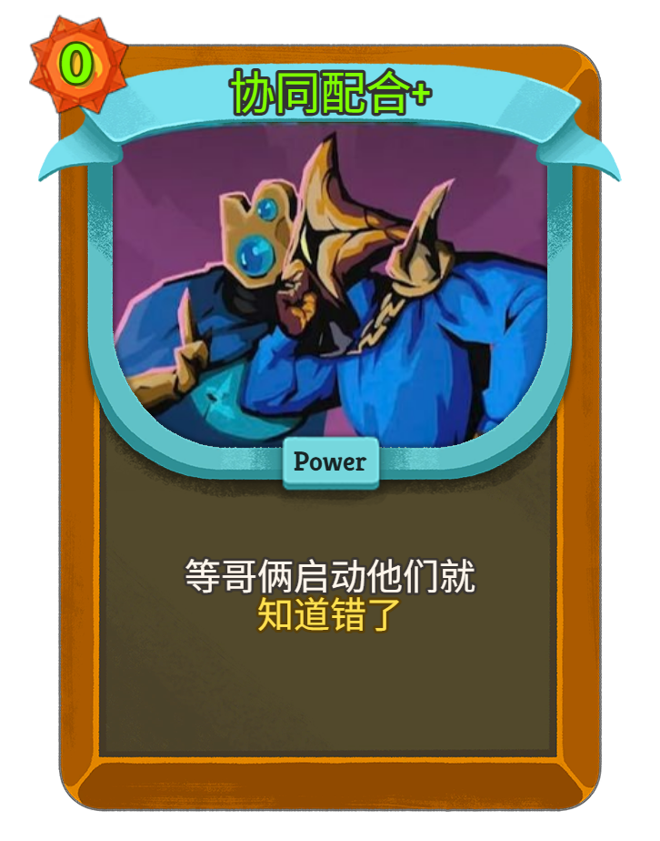

# STS2 Adviser — 杀戮尖塔2 实时选牌导师

<p align="right"><a href="README_EN.md">English</a></p>

<p align="center">
  
</p>

进入选卡界面时自动截图识别候选卡，读取游戏存档和日志，综合套路契合度、固有价值、阶段适配、完成度贡献、遗物协同五个维度评分，并与社区胜率/选取率数据交叉验证，以置顶浮窗形式给出推荐评分和理由。

## 设计理念

这个工具**不是要替代玩家的思考和判断**，而是在新手困惑时期提供参考。

反复对照攻略效率很低，而完全依赖数值优化有几个根本局限：

- **数据权威性**：真正完整的平衡数据在开发者手里。无论是社区样本统计，还是手动建模计算伤害/格挡边际，都只是在局部维度上做精确——而开发者的平衡是跨维度整体设计的。用片面数据推算"最优解"，本质上是在和这套平衡对抗，既不可靠，也有些南辕北辙。
- **玩家自主性**：强调数值最优会压缩玩家自主判断的空间，也无法量化个人偏好和风格。
- **联机盲区**：为了配合队友而主动拿某张协作牌，可能是当局最正确的决策，但工具对此一无所知。被 carry、反向 carry、与队友的配合关系，都是评分触及不到的维度。
- **跨角色选卡**：STS2 增加了更多跨角色选卡的事件与触发机制，这类牌脱离了本角色的套路体系，与维度评分存在根本性错位，同时也涉及队友视角、风格偏好等上述综合因素，因此不纳入考量范围。

因此，评分系统选择基于**套路权重**：给出一个"这张牌方向对不对"的参考，而不是"你必须拿这张"的命令。高分意味着"契合当前思路"，低分意味着"偏离方向或价值存疑"——最终决策权始终在玩家手里。

## 快速开始

### 方式一：直接运行 EXE（推荐，无需安装 Python）

1. 前往 [Releases](https://github.com/Skyerolic/sts2-adviser/releases) 下载最新版 ZIP
2. 解压后双击 `sts2_adviser.exe`

### 方式二：从源码运行

```bash
# 安装依赖
pip install -r requirements.txt

# 启动
python main.py
```

## 使用说明

### 自动模式（OCR）

启动后浮窗置顶显示在游戏上方。进入选卡界面时，助手自动截图识别三张候选卡并给出评分，无需任何操作。

**调整窗口大小**：拖拽浮窗右下角的缩放手柄可以自由调整大小，字体会随窗口等比缩放。

### 手动选牌模式

点击浮窗右侧的 **◀** 按钮展开选牌抽屉，窗口向右扩展，不占用主面板空间。

1. 抽屉顶部按 **攻击 / 技能 / 能力 / 先古** 分大类列出当前角色所有卡牌；点击大类标题可折叠/展开
2. 每个大类内按费用（0费、1费、2费、3费+）进一步分段
3. 顶部搜索框可按名称实时过滤卡牌，搜索时自动展开所有大类
4. 点击卡片选中（高亮），最多选 4 张；再次点击或点击已选托盘中的标签可取消选中
5. 点击底部 **⟳ 评估** 按钮，主面板显示评分结果
6. 再次点击 **▶** 收起抽屉

### 最小化与快捷键

- 点击标题栏 **−** 按钮隐藏浮窗，图标驻留系统托盘；双击托盘图标恢复显示
- 默认全局快捷键 **Ctrl+Shift+S** 可随时呼出或隐藏浮窗（可在设置中自定义）

### 配置游戏日志路径

GameWatcher 读取游戏日志来获取角色、楼层、当前牌组信息，让评分更准确（尤其是阶段适配和完成度维度）。不配置时仅凭 OCR 结果评分。

**自动搜索**：启动时会自动尝试以下路径：
```
%AppData%\Roaming\SlayTheSpire2\
%AppData%\Local\SlayTheSpire2\saves\
C:\Program Files (x86)\Steam\steamapps\common\SlayTheSpire2\
```

**手动配置**：若自动搜索失败，在设置界面（齿轮图标）填入游戏日志路径，或运行诊断工具：
```bash
python diagnose_save_path.py
```
配置保存在 `~/.sts2-adviser/config.json`，重启后生效。

### OCR 识别效果不佳？

**首先尝试：将游戏窗口最大化。**
OCR 依赖游戏窗口截图的分辨率，窗口越大识别越准确。小窗口下卡名文字太小容易误读。

其他措施：
- 确认游戏语言设置为中文界面
- 确认游戏窗口标题包含 `Slay the Spire 2`
- 在选卡界面运行诊断工具，查看截图和 OCR 分段效果：
  ```bash
  python diagnose_ocr.py
  ```

## 模块说明

```
sts2-adviser/
├── main.py                     # 集成启动入口：同时启动后端服务和前端浮窗
│
├── backend/                    # FastAPI 后端，处理评估逻辑
│   ├── main.py                 # HTTP/WebSocket 服务器，协调 GameWatcher 和 VisionBridge
│   ├── evaluator.py            # 评估引擎：调用各维度评分，汇总结果和推荐理由
│   ├── scoring.py              # 五维度评分算法 + 社区数据交叉验证
│   ├── archetypes.py           # 套路库：每个角色的套路定义和核心卡列表
│   ├── archetype_inference.py  # 套路推断：对未在套路列表中的卡用关键词推断权重
│   └── models.py               # 数据模型：Card / RunState / ScoreBreakdown 等
│
├── frontend/                   # PyQt6 浮窗界面
│   ├── ui.py                   # 主窗口：置顶浮窗、拖拽、评分展示、侧边选牌抽屉
│   ├── card_locale.py          # 英文卡 ID → 中文名映射
│   └── styles.qss              # 深色主题样式（杀戮尖塔风格）
│
├── vision/                     # 视觉识别模块
│   ├── vision_bridge.py        # 总调度：定时轮询截图，驱动状态机，推送识别结果
│   ├── window_capture.py       # 用 PrintWindow API 截图（窗口被遮挡时仍有效）
│   ├── ocr_engine.py           # Windows WinRT OCR 封装，含 OpenCV/PIL 预处理
│   ├── screen_detector.py      # 判断当前界面类型（选卡 / 商店 / 其他）
│   └── card_normalizer.py      # OCR 结果后处理：误读修正 + fuzzy 白名单匹配
│
├── data/
│   ├── cards.json              # 卡牌库：费用、稀有度、类型等元数据
│   ├── card_library.json       # 社区统计：每张卡的胜率和选取率
│   ├── archetypes.json         # 套路定义：27 个套路的卡牌权重与角色分类
│   ├── card_summaries.json     # 自动生成的卡牌文字总结（覆盖率 ~85%）
│   ├── card_locale_zh.json     # 中文本地化：英文 ID → 中文卡名
│   └── card_names_zh.json      # 中文卡名索引（OCR 匹配用）
│
├── scripts/
│   ├── game_watcher.py         # 监视游戏日志文件，解析角色 / 楼层 / 牌组 / 遗物
│   ├── config_manager.py       # 读写 ~/.sts2-adviser/config.json（日志路径、语言等）
│   └── generate_card_summaries.py  # 离线生成 card_summaries.json
│
├── diagnose_ocr.py             # 诊断工具：截图并输出 OCR 分段结果，排查识别问题
└── diagnose_save_path.py       # 诊断工具：自动搜索游戏存档和日志路径
```

### 数据流

```
游戏窗口
  │
  ├─ PrintWindow 截图 ──→ OCR 引擎 ──→ card_normalizer ──→ 卡名列表
  │                                                              │
  └─ 游戏日志文件 ──→ GameWatcher ──→ RunState（角色/楼层/牌组）  │
                                              │                  │
                                              └──────────────────┤
                                                                 ▼
                                                          evaluator（五维度评分）
                                                                 │
                                                                 ▼
                                                        前端浮窗展示结果
```

## 评分算法

### 五维度加权评分

每张候选卡按以下五个维度独立评分（均归一化到 0~1），加权合并后映射到 0~100 分：

> **计划加入（尚未实现）**：血量维度——当前血量/最大血量比例低时，对治疗/防御类卡加权；深度维度——基于当前牌组厚度动态调整卡牌价值（厚牌组下低价值卡的惩罚将更激进）。

| 维度 | 权重 | 评分逻辑 |
|------|------|----------|
| 套路契合度 | **40%** | 取该卡在所有匹配套路中的最高权重；无匹配返回 0（由固有价值兜底） |
| 卡牌固有价值 | **25%** | 稀有度基线（Ancient 0.95 / Rare 0.88 / Uncommon 0.62 / Common 0.38）+ 费用效率（0 费 +0.10，3 费以上 -0.06） |
| 阶段适配 | **15%** | 核心/使能卡后期分更高（早 0.75 → 晚 0.88）；过渡卡早期强（早 0.92 → 晚 0.12）；污染牌固定 0 |
| 完成度贡献 | **15%** | 拿这张后套路完成度 delta × 3（放大系数，因单张卡通常仅提升 5~10%） |
| 协同加成 | **5%** | 与当前遗物 / 卡组的标签重叠，每个匹配标签 +0.20，上限 1.0 |

**惩罚项**（直接从原始分扣除，不经权重）：
- **污染惩罚**：污染牌 −0.50，牌组每多一张折扣 0.015（上限抵扣 0.25）
- **厚牌组惩罚**：牌组 ≥ 20 张后，低价值牌每多一张 −0.01（上限 0.15）；核心/使能卡豁免

最终分档：

| 分数 | 推荐等级 |
|------|----------|
| 80~100 | 强烈推荐 |
| 65~79  | 推荐 |
| 50~64  | 可选 |
| 30~49  | 谨慎 |
| 0~29   | 跳过 |

### 社区数据交叉验证

社区胜率 / 选取率经 sigmoid 归一化后与算法分混合（最大权重 25%，另有 15% 补丁滞后折扣）：

| 比较结果 | 判定 | 处理方式 |
|----------|------|----------|
| delta ≤ 0.15 | AGREEMENT（同趋势） | 双方向上/向下各放大 5%，置信度 100% |
| 0.15 < delta ≤ 0.30 | SOFT_CONFLICT | 社区权重打 75%，折中混合 |
| delta > 0.30 | CONFLICT | 社区权重打 50%，算法分优先 |
| 无社区数据 | — | 直接使用算法分 |

### 评分盲区：先古之民

先古之民卡牌**不在评分体系范围内**，选择时会显示提示而非评分。

原因：先古之民的设计逻辑独立于常规套路体系，强行套用五维度评分会给出误导性结果。它们的价值高度依赖具体局势、队友选择和玩家对该类卡的理解——这正是本工具设计上主动回避的判断边界。手动选牌抽屉中仍可选中这些卡送入评估请求，但结果仅供参考。

## 系统要求

- **Windows 10 / 11**（依赖 Windows 内置 OCR）
- Python 3.10+
- 推荐安装 `opencv-python`（OCR 预处理质量更好）：
  ```bash
  pip install opencv-python
  ```

## 故障排查

**找不到游戏窗口**：确认游戏窗口标题包含 `Slay the Spire 2`

**OCR 识别率低**：先把游戏窗口最大化再试；或运行诊断工具：
```bash
python diagnose_ocr.py
```

**后端连接失败**：手动启动后端：
```bash
python -m uvicorn backend.main:app --port 8001
```

---

## 版本历史

### v1.6.2（当前）
- **中文卡名识别修复（Issue #5）**：OCR 读到 2–3 字中文卡名（如"熔融"、"强化"、"双重"）时，原先 0.55 的平坦模糊阈值会让它们错误锁定到 4 字超集卡——`fuzz.ratio('打击','双重打击')=0.667` 恰好越过阈值，而中文卡库里 46% 的卡是 2 字。`CardNameIndex.search` 现按语言分区（CJK 只搜中文列表、ASCII 只搜英文列表），走精确匹配快速通道，采用长度感知阈值（CJK ≤3 字 0.85 / ≥4 字 0.70，英文保持 0.55），并在 top-1/top-2 置信度差距 <0.05 时拒绝歧义结果——让槽位保持未锁定等下一帧重识别，而不是锁入错误卡
- **套路标签语言跟随完善**：v1.6.1 的"套路名语言跟随"只覆盖了理由文字和底部检测标签，卡名右侧彩色套路标签（✦核心 / ●辅助 / ·填充 / ✗污染）仍硬编码用 `name_zh`，英文界面下仍显示中文。现在后端映射同时存 `{zh, en}` 双语名，标签按当前 UI 语言取名；英文标签最多 14 字、中文仍为 6 字

### v1.6.1
- **游戏本体 Major Update #1（v0.103.2）数据同步**：卡牌库更新（新增/删除/修改）、中文本地化、遗物数据、遗物-套路映射全面更新；套路权重补充 DOMINATE / STOKE / BLADE_OF_INK / ARSENAL / NOT_YET / SPITE / FOLLOW_THROUGH / BORROWED_TIME 等多张新卡
- **套路路径影响可视化（Issue #4）**：每张候选牌旁新增彩色套路标签，显示对当前角色**全部套路**的兼容性（✦核心 / ●辅助 / ·填充 / ✗污染）；无需先锁定套路，游戏早期即可看到"这张牌会走哪条路"
- **社区数据算法重构**：胜率/选取率改用 sigmoid 归一化偏差值（±偏差整数）替代原始百分比；新增放弃率权重；divergence（胜率偏差 − 选取偏差）超阈值时展示"潜力股"/"高估风险"标签
- **套路名语言跟随**：套路名称（理由文字、底部检测标签）现在完全跟随语言设置；中文显示 `name_zh`（如"毒素"），英文显示 `name`（如"Silent: Poison"）；移除硬编码 split 逻辑
- **UI 整合与字体自适应**：卡牌摘要 + 推荐理由 + 不推荐理由合并为单行彩色富文本；字体改用 `QFont.setPixelSize()` 跟随系统 DPI；评分颜色调整（S=金色、A=绿色、B=蓝色）；套路标签移至卡名同行
- **日志规范化**：backend 全部 `print()` 调用改为 `logging`，统一写入日志文件
- **套路权重补全（27条）**：补录高胜率但缺失精确权重的核心牌导致的过低评价，现在核心会正确显示推荐
- **OCR 动态分区**：用 resolved_centers 中点动态计算三槽位区域边界，替换原来基于 &lt;1500px 的硬编码阈值，窗口任意大小均可自适应
- **OCR 候选选择策略优化**：改为按 bbox X 中心与裁剪区中心距离最近的候选，解决宽分区内多卡名并存时选错的问题（如 slot1 误识别为"切割"而非"触不可及"）
- **评分等级简化**：去除 D 等级，低分统归 C；颜色方案简化为金/绿/蓝/橙红四色

### v1.2.5
- **套路库扩充（17 → 27）**：新增 10 个套路，覆盖 Ironclad（Block/Body Slam · Vulnerable 压制 · Strike 增幅）、Silent（敏捷格挡 · Retain 爆发）、Defect（冰球格挡 · Claw 循环）、Necrobinder（Soul 排除引擎 · Osty 防御强化）、Regent（Retain 控制）；所有套路经 2 个以上社区来源确认，卡牌 ID 均在数据库中验证
- **评分分布优化**：稀有度基线拉开（Ancient 0.95 / Rare 0.88 / Uncommon 0.62 / Common 0.38），无套路早期 TRANSITION `phase_score` 提升至 0.92；地板补偿按稀有度三档分级，Rare 补偿较小，Common 保留完整补偿。实际效果：Rare 过渡牌 B（51~57）· Uncommon B/B-（44~52）· Common C+（~40），分层清晰
- **卡牌文字总结**：新增 `data/card_summaries.json`，覆盖 84.9%（489/576 张）可评分卡；每条总结自动组合卡牌定位、套路归属、社区胜率/选取率和使用建议；中文模式下评分结果底部以灰色斜体显示
- 附 `scripts/generate_card_summaries.py`，套路或数据更新后可本地重新生成

### v1.2.1
- **评分系统校准**：修正评分普遍偏低的问题
  - 权重调整：套路契合度 0.40→0.35，卡牌固有价值 0.25→0.30，减少对套路匹配的过度依赖
  - 新增地板补偿：无套路命中的非污染牌补 +8 分，避免有用的通用牌被错误归入"跳过"档
  - 过渡牌识别：早期小牌库（≤15张）中，无套路命中的廉价牌（0/1费 COMMON/UNCOMMON）自动识别为过渡牌，给予早期阶段加权评分（0.85），中期平滑降至 0.60，后期 0.15
  - 过渡牌条件收紧：排除 STATUS/CURSE 类型；有套路匹配时一律走正常 FILLER 路径，避免干扰套路边缘牌的评分

### v1.2.0
- **最小化到托盘**：标题栏新增 `−` 最小化按钮，点击后隐藏浮窗并在系统托盘驻留；托盘双击或右键菜单可恢复显示，避免窗口在任务栏消失后无法找回
- **先古之民卡牌支持**：手动选牌抽屉新增「先古」分组，以紫色样式区分；修复了 Ancient 卡被过滤的问题。评估时显示「超出套路评分体系」提示而非强行打分，避免误导；修复对先古/诅咒卡评估时的 500 错误。尽管实际游戏中不会出现选择这些卡的情形，工具也无意干涉玩家的取向，但手动选牌模式支持选入先古卡体验评分流程——可以试着把它们放进去看看
- **再次点击取消选中**：卡片按钮支持再次点击取消选中；已选卡托盘中的标签也可点击取消，无需再滚动回原位
- **卡牌搜索框**：侧边抽屉顶部新增搜索输入框，实时按名称过滤卡牌；分组标题随内容动态显示/隐藏
- **字体缩放系统**：设置对话框新增滑块（80%–160%），实时预览，保存后立即生效；字体切换为 Microsoft YaHei UI，中英文显示均更清晰
- **窗口透明度**：设置对话框新增透明度滑块（40%–100%），实时预览；取消设置时自动还原
- **自定义全局快捷键**：设置对话框新增快捷键输入框，默认 `Ctrl+Shift+S`，可呼出/隐藏浮窗；保存后即时生效，无需重启
- **检查更新**：启动 3 秒后静默查询 GitHub Releases，有新版本时标题栏显示 `🆕` 按钮，点击跳转发布页
- **关于菜单**：工具栏新增 `?` 按钮，下拉菜单提供 GitHub 项目页和 Steam 创意工坊链接
- **完整双语支持**：所有 UI 文本支持中英文切换，语言切换即时生效无需重启；设置对话框所有选项均支持实时预览和取消还原
- **遗物协同扩展**：新增 30+ 条遗物套路映射（Silent / Defect / Necrobinder / Regent），新增跨角色通用与先古遗物的协同数据
- **缩放手柄增大**：右下角缩放手柄从 24px 放大至 32px，颜色更醒目，更易拖拽；叠加 `⤡` 符号提示方向

### v1.0.0
- **EXE 正式可用**：首个完整可独立运行的打包版本，无需安装 Python，解压即用
- **GameWatcher 修复**：`scripts/` 改为标准 Python 包，EXE 模式下角色/楼层/牌组信息现可正确加载，套路契合度评分更准确
- **路径修复（PyInstaller 6.x）**：用 `sys._MEIPASS` 解析 `_internal/` 目录，`data/`、`styles.qss`、日志路径在 EXE 模式下均正确
- **进程退出修复**：改用 `os._exit()` 关闭浮窗后立即终止全部进程（含 uvicorn 后端线程）
- **UI 调整**：初始窗口高度增大 1.5 倍（600×750），右下角缩放手柄改为金色可见样式

### v0.9.9
- **EXE 打包路径兼容**：新增 `utils/paths.py`，统一所有模块的根目录解析（开发模式 vs PyInstaller frozen 模式），修复 EXE 运行时 `data/`、`logs/`、`styles.qss` 路径错位问题
- **依赖拆分**：`requirements-prod.txt`（仅生产依赖）与 `requirements.txt`（开发+测试）分离，用户安装更简洁
- **build_exe.bat 升级**：自动创建/复用 `.venv` 虚拟环境，仅安装生产依赖，打包后显示目录大小并检测 UPX
- **spec 补全**：补充 `rapidfuzz`、`psutil`、`mss`、`PIL`、`numpy`、`anyio._backends._trio`、`uvicorn.protocols.websockets.wsproto_impl` 等 hidden imports，打包覆盖率更完整

### v0.9.5
- **遗物协同系统完善**：新增 `relic_archetype_map.py` 遗物→套路适配度映射；补充 `data/relics.json` 遗物定义数据
- **社区数据补全**：`data/card_library.json` 覆盖全部可用卡牌的胜率和选取率统计
- **打包基础设施**：新增 `build_exe.bat` 和 `sts2_adviser.spec`，支持一键打包为无需安装 Python 的独立 EXE

### v0.9.0
- **代码质量清理**：全面替换 `print` 调试输出为结构化 `logging`，提升日志可读性
- **vision_bridge.py 精简**：移除冗余的独立 OCR 方法，统一为 `_extract_card_names_combined` 双策略（全图聚类 + 区域补全）
- **UI 修复**：
  - 抽屉展开/收起时窗口宽度动态伸缩（不再截断卡名）
  - 启动后自适应窗口高度（由 `_auto_fit_height` 在布局完成后调整）
  - 卡片按钮改为 `Expanding` 策略，宽度均匀分布

### v0.8.0
- **OCR 稳定性大幅提升**：
  - 白名单过滤策略替代黑名单（fuzzy 匹配自动过滤所有乱码，无需手动维护规则）
  - 全图 OCR 候选区 Y 范围精确收窄，排除卡牌类型标签行（攻击/技能）
  - OCR 并发锁，防止 WinRT RecognizeAsync 重叠调用
  - `win32gui` 不可用时自动降级为 ctypes 枚举窗口
- **OpenCV 预处理**：有 OpenCV 时使用 INTER_CUBIC 放大 + CLAHE + 高斯去噪 + 锐化；无 OpenCV 时 PIL 对比度增强回退
- **中文 OCR 误读修正表扩充**：覆盖煊融之拳、双重打击等高频卡名乱码
- **UI 重构**：
  - 字体整体放大 20%
  - 候选卡垂直布局（卡名 → 中文定位 → 分数 → 推荐 → 理由）
  - 手动选牌改为侧边抽屉（◀/▶ 控制展开/收起），展开时窗口向右扩展，不占用主面板空间
  - 推荐理由分色显示（绿色 / 橙红）
  - 卡牌选择面板改为 3 列网格，加宽至 340px，防止卡名截断

### v0.7.0
- 社区数据交叉验证层：算法评分与社区胜率 / 选取率联合决策
- sigmoid 归一化将社区统计转换为 0~1 评分
- AGREEMENT / SOFT_CONFLICT / CONFLICT 三档置信度调整
- 推荐理由新增社区数据相关说明

### v0.6.0
- 套路推断层（`archetype_inference.py`）：基于关键词 / 描述文本自动推断卡牌套路权重
- 覆盖铁甲人 / 沉默者 / 机器人 / 守望者共 11 个套路推断配置
- 不在精确卡牌列表中的卡也能获得推断权重，显著扩大套路覆盖面

### v0.5.0
- OCR 识别重写：双策略（全图聚类 + 区域补全）
- 评分引擎重构（archetype / value / phase / completion / synergy 五维度）
- 日志基础设施：评分 JSON 日志 + OCR 快照自动保存
- WebSocket 稳定性修复（UTF-8 编码 / asyncio 阻塞问题）

### v0.1.0 — v0.4.0
- 项目初始化，基础 FastAPI 后端 + PyQt6 浮窗
- Windows PrintWindow 截图模块
- Windows OCR 引擎封装
- 游戏日志文件监视器（GameWatcher）

---

## 开源协议

本项目基于 [GNU GPL-3.0](LICENSE) 协议开源。

[](https://www.gnu.org/licenses/gpl-3.0)

你可以自由使用、修改和分发本项目，但衍生作品必须以相同协议开源，不得闭源商用。

Copyright (c) 2026 Skyerolic
