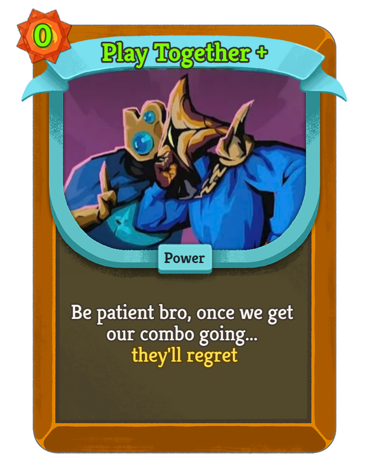

# STS2 Adviser — Slay the Spire 2 Real-Time Card Pick Advisor

<p align="right"><a href="README.md">中文</a></p>

<p align="center">
  
</p>

Automatically captures the card reward screen via screenshot, reads your save file and game log, scores each candidate card across five dimensions — archetype fit, inherent value, phase adaptation, completion contribution, and relic synergy — then cross-validates against community win-rate/pick-rate data. Results are displayed as a pinned overlay on top of the game window.

## Design Philosophy

This tool is **not meant to replace player judgment** — it's a reference for players who feel uncertain, especially early on when repeatedly cross-referencing guides is slow and inefficient.

Chasing pure numerical optimization runs into a few fundamental limits:

- **Data authority**: The only source with truly complete balance data is the developers themselves. Whether it's community win-rate samples or manually modelling damage/block margins, every approach is precise within a narrow slice — but the developers balanced the game across all dimensions at once. Deriving an "optimal pick" from any partial view means working against that design, which is both unreliable and somewhat self-defeating.
- **Player agency**: Optimizing purely for numbers crowds out individual judgment, playstyle, and preference.
- **Co-op blind spots**: Deliberately picking a synergy card to support a teammate might be the single best decision of the run — but the tool has no way of knowing that. Being carried, carrying others, and the dynamics of coordination are entirely outside what any score can capture.
- **Cross-class card picks**: STS2 introduced more events and triggers that offer cards from other characters' pools. These cards sit outside the current character's archetype framework — scoring them through the same five dimensions produces a fundamental mismatch. Combined with the co-op, playstyle, and data factors above, cross-class picks are intentionally excluded from evaluation.

That's why the scoring system is built on **archetype weights**: it answers "does this card fit my direction?" rather than "you must take this card." A high score means "aligns well with your current gameplan." A low score means "questionable fit or unclear value." **The final decision always belongs to the player.**

## Quick Start

### Option 1: Run the EXE (recommended, no Python required)

1. Go to [Releases](https://github.com/Skyerolic/sts2-adviser/releases) and download the latest ZIP
2. Unzip and double-click `sts2_adviser.exe`

### Option 2: Run from source

```bash
# Install dependencies
pip install -r requirements.txt

# Launch
python main.py
```

## Usage

### Auto Mode (OCR)

The overlay appears on top of the game window when launched. When the card reward screen appears, the advisor automatically captures the window, recognizes the three candidate cards, and shows their scores — no interaction needed.

**Resize**: Drag the handle in the bottom-right corner to freely resize the overlay; font scales proportionally.

### Manual Card Selection Mode

Click the **◀** button on the right side of the overlay to expand the card picker drawer. The window extends to the right without covering the main panel.

1. Cards are listed by **Attack / Skill / Power / Ancient** — click a group header to collapse or expand it
2. Within each group, cards are subdivided by cost (0, 1, 2, 3+)
3. Use the search box at the top to filter by name; searching auto-expands all groups
4. Click a card to select it (highlighted); click again or click a tag in the selection tray to deselect
5. Click **⟳ Evaluate** to show scores in the main panel
6. Click **▶** again to collapse the drawer

### Minimize and Hotkey

- Click the **−** button in the title bar to hide the overlay; the icon stays in the system tray
- Double-click the tray icon to restore the window
- Default global hotkey **Ctrl+Shift+S** shows/hides the overlay from anywhere (customizable in Settings)

### Configuring the Game Log Path

GameWatcher reads the game log to get character, floor, and deck info, enabling more accurate phase adaptation and completion scores. Without it, scoring is based solely on OCR results.

**Auto-detect**: On startup the app tries these paths automatically:
```
%AppData%\Roaming\SlayTheSpire2\
%AppData%\Local\SlayTheSpire2\saves\
C:\Program Files (x86)\Steam\steamapps\common\SlayTheSpire2\
```

**Manual config**: If auto-detect fails, set the path in Settings (gear icon), or run the diagnostic tool:
```bash
python diagnose_save_path.py
```
Config is saved to `~/.sts2-adviser/config.json` and takes effect on restart.

### OCR Not Recognizing Cards?

**First try: maximize the game window.**  
OCR relies on the resolution of the captured window — larger windows produce cleaner text.

Other steps:
- Confirm the game language is set to the language you expect
- Confirm the game window title contains `Slay the Spire 2`
- Run the OCR diagnostic on the card reward screen:
  ```bash
  python diagnose_ocr.py
  ```

## Module Overview

```
sts2-adviser/
├── main.py                     # Entry point: starts backend service and frontend overlay
│
├── backend/                    # FastAPI backend, handles evaluation logic
│   ├── main.py                 # HTTP/WebSocket server, coordinates GameWatcher and VisionBridge
│   ├── evaluator.py            # Evaluation engine: calls each scoring dimension, aggregates results
│   ├── scoring.py              # Five-dimension scoring algorithm + community data cross-validation
│   ├── archetypes.py           # Archetype library: archetype definitions and core card lists per character
│   ├── archetype_inference.py  # Archetype inference: keyword-based weight inference for unlisted cards
│   └── models.py               # Data models: Card / RunState / ScoreBreakdown etc.
│
├── frontend/                   # PyQt6 overlay window
│   ├── ui.py                   # Main window: topmost overlay, drag, score display, side drawer
│   ├── card_locale.py          # English card ID → Chinese name mapping
│   └── styles.qss              # Dark theme stylesheet (Slay the Spire style)
│
├── vision/                     # Visual recognition module
│   ├── vision_bridge.py        # Orchestrator: polls screenshots, drives state machine, pushes results
│   ├── window_capture.py       # PrintWindow API capture (works even when window is occluded)
│   ├── ocr_engine.py           # Windows WinRT OCR wrapper with OpenCV/PIL preprocessing
│   ├── screen_detector.py      # Detects current game screen type (card reward / shop / other)
│   └── card_normalizer.py      # OCR post-processing: misread correction + fuzzy whitelist matching
│
├── data/
│   ├── cards.json              # Card database: cost, rarity, type metadata
│   ├── card_library.json       # Community stats: win rate and pick rate per card
│   ├── archetypes.json         # Archetype definitions: 27 archetypes with card weights per character
│   ├── card_summaries.json     # Auto-generated card text summaries (~85% coverage)
│   ├── card_locale_zh.json     # Localization: English ID → Chinese card name
│   └── card_names_zh.json      # Chinese card name index (used for OCR matching)
│
├── scripts/
│   ├── game_watcher.py         # Monitors game log file, parses character / floor / deck / relics
│   ├── config_manager.py       # Read/write ~/.sts2-adviser/config.json (paths, language, font scale, hotkey)
│   └── generate_card_summaries.py  # Offline script to regenerate card_summaries.json
│
├── diagnose_ocr.py             # Diagnostic: capture screenshot and print OCR segmentation output
└── diagnose_save_path.py       # Diagnostic: auto-search for game save and log paths
```

### Data Flow

```
Game Window
  │
  ├─ PrintWindow capture ──→ OCR engine ──→ card_normalizer ──→ card name list
  │                                                                    │
  └─ Game log file ──→ GameWatcher ──→ RunState (char/floor/deck)      │
                                              │                        │
                                              └────────────────────────┤
                                                                       ▼
                                                         evaluator (five-dimension score)
                                                                       │
                                                                       ▼
                                                            Overlay displays results
```

## Scoring Algorithm

### Five-Dimension Weighted Score

Each candidate card is scored independently on five dimensions (all normalized to 0–1), then combined with weights and mapped to 0–100:

> **Planned (not yet implemented)**: HP dimension — boost healing/defensive cards when current HP ratio is low; Depth dimension — dynamically penalize low-value cards as deck size grows.

| Dimension | Weight | Logic |
|-----------|--------|-------|
| Archetype fit | **40%** | Highest weight across all matching archetypes; returns 0 if no match (inherent value acts as floor) |
| Inherent value | **25%** | Rarity baseline (Ancient 0.95 / Rare 0.88 / Uncommon 0.62 / Common 0.38) + cost efficiency (0-cost +0.10, 3+ cost −0.06) |
| Phase adaptation | **15%** | Core/enabler cards score higher late (early 0.75 → late 0.88); transitional cards stronger early (early 0.92 → late 0.12); curse fixed 0 |
| Completion contribution | **15%** | Archetype completion delta after adding this card × 3 (amplified because a single card typically only adds 5–10%) |
| Synergy bonus | **5%** | Tag overlap with current relics/deck; +0.20 per matching tag, capped at 1.0 |

**Penalties** (subtracted from raw score directly, bypass weights):
- **Curse penalty**: curse card −0.50; each additional curse in deck −0.015 (capped at −0.25)
- **Thick deck penalty**: deck ≥ 20 cards; each additional low-value card −0.01 (capped at −0.15); core/enabler cards exempt

Final tiers:

| Score | Recommendation |
|-------|---------------|
| 80–100 | Strongly Recommended |
| 65–79  | Recommended |
| 50–64  | Viable |
| 30–49  | Caution |
| 0–29   | Skip |

### Community Data Cross-Validation

Community win rate / pick rate is sigmoid-normalized and blended with the algorithm score (max weight 25%, with a 15% patch-lag discount):

| Comparison | Status | Handling |
|------------|--------|---------|
| delta ≤ 0.15 | AGREEMENT | Amplify both scores 5% in the shared direction, confidence 100% |
| 0.15 < delta ≤ 0.30 | SOFT_CONFLICT | Community weight reduced to 75%, blended compromise |
| delta > 0.30 | CONFLICT | Community weight reduced to 50%, algorithm score takes priority |
| No community data | — | Use algorithm score directly |

### Scoring Blind Spot: Ancient Cards

Ancient cards are **outside the scoring system's scope** — selecting one shows an advisory note rather than a score.

The reason: Ancient cards are designed outside the normal archetype framework, so running them through the five-dimension model produces misleading results. Their value is highly situational, dependent on your teammate's choices and your own understanding of the card — precisely the kind of judgment call this tool is designed not to override. You can still select Ancient cards in the manual picker and include them in an evaluation request, but treat any output as purely illustrative.

## System Requirements

- **Windows 10 / 11** (depends on Windows built-in OCR)
- Python 3.10+
- Recommended: install `opencv-python` for better OCR preprocessing:
  ```bash
  pip install opencv-python
  ```

## Troubleshooting

**Game window not found**: Confirm the window title contains `Slay the Spire 2`

**Low OCR accuracy**: Maximize the game window first; or run the diagnostic:
```bash
python diagnose_ocr.py
```

**Backend connection failed**: Start the backend manually:
```bash
python -m uvicorn backend.main:app --port 8001
```

---

## Changelog

### v1.6.1 (current)
- **Game Major Update #1 (v0.103.2) data sync**: Updated card database (additions/removals/modifications), Chinese localization, relic data, and relic-archetype mappings; added archetype weights for DOMINATE / STOKE / BLADE_OF_INK / ARSENAL / NOT_YET / SPITE / FOLLOW_THROUGH / BORROWED_TIME and other new cards
- **Path impact visualization (Issue #4)**: Colored archetype tags now appear next to each candidate card name, showing compatibility with **all** current character archetypes (✦ core / ● enabler / · filler / ✗ pollution); visible from game start — no archetype lock required
- **Community data algorithm overhaul**: Win rate / pick rate now displayed as sigmoid-normalized deviation values (±integer) instead of raw percentages; skip rate added as a factor; divergence (win deviation − pick deviation) beyond threshold shows "hidden gem" / "overhyped" tags
- **Language-aware archetype names**: Archetype names in reason text and bottom detection label now follow the language setting — Chinese shows `name_zh` (e.g. "毒素"), English shows `name` (e.g. "Silent: Poison"); removed hardcoded split logic
- **UI consolidation and font DPI scaling**: Card summary + reasons merged into a single colored rich text line; font now uses `QFont.setPixelSize()` for proper DPI scaling; grade colors updated (S=gold, A=green, B=blue); archetype tags moved to the same row as card name
- **Log cleanup**: All `print()` calls in backend replaced with `logging`, unified into log file output
- **Archetype weight coverage (+27 entries)**: Added missing core/enabler weights for high win-rate cards — Silent (ACCELERANT/CORROSIVE_WAVE/FAN_OF_KNIVES/KNIFE_TRAP/STORM_OF_STEEL/AFTERIMAGE/SHADOWMELD/MALAISE), Ironclad (TEAR_ASUNDER), Defect (ECHO_FORM/VOLTAIC/MODDED/FLAK_CANNON/TRASH_TO_TREASURE/BUFFER etc.), Necrobinder (REANIMATE/HANG/DEBILITATE/BANSHEES_CRY etc.), Regent (BIG_BANG/VOID_FORM/DECISIONS_DECISIONS etc.)

### v1.25
- **Archetype library: 17 → 27**: 10 new archetypes covering Ironclad (Block/Body Slam · Vulnerable Pressure · Strike Scaling), Silent (Dexterity Block · Retain Burst), Defect (Frost Block · Claw Cycle), Necrobinder (Soul Exhaust Engine · Osty Defense Buff), Regent (Retain Control); each confirmed by 2+ community sources with all card IDs verified in the database
- **Score distribution fix**: Rarity baselines widened (Ancient 0.95 / Rare 0.88 / Uncommon 0.62 / Common 0.38); no-archetype TRANSITION early-game `phase_score` raised to 0.92; floor bonus now tiered by rarity — Rare receives less compensation, Common retains the full floor. Result: Rare transition cards B (51–57) · Uncommon B/B− (44–52) · Common C+ (~40)
- **Card text summaries**: New `data/card_summaries.json` covering 84.9% (489/576) of scoreable cards; each entry combines card type, archetype fit, community win/pick rate, and usage tips; displayed as a grey italic line at the bottom of each card result in Chinese mode
- `scripts/generate_card_summaries.py` included to regenerate locally after archetype or data updates

### v1.21
- **Scoring system calibration**: Fixed systematically low scores
  - Weight rebalance: archetype fit 0.40→0.35, inherent value 0.25→0.30 — reduces over-reliance on archetype matching
  - Floor bonus: non-pollution cards with no archetype match receive +8 points, preventing useful generic cards from landing in the "Skip" tier
  - Transition card recognition: in early game with small deck (≤15 cards), cheap cards (0/1 cost, Common/Uncommon) with no archetype match are identified as transition cards and receive phase-weighted scoring (0.85 early → 0.60 mid → 0.15 late)
  - Tightened transition conditions: STATUS/CURSE types excluded; cards with any archetype match stay on the normal FILLER path to avoid interfering with archetype edge cards

### v1.2
- **Minimize to tray**: New `−` button in title bar hides the overlay to the system tray; double-click the tray icon or use the right-click menu to restore
- **Ancient card support**: Manual picker now includes an "Ancient" group with distinct purple styling; fixes a bug where Ancient cards were filtered out. Evaluation returns an advisory note ("outside archetype scoring") rather than a misleading score; fixes 500 errors when evaluating Ancient/Curse cards. Ancient cards won't appear in actual card rewards, and the tool has no interest in steering player choices — but the manual picker lets you add them anyway and see what happens
- **Click again to deselect**: Click a selected card chip again to deselect it; clicking a tag in the selection tray also deselects without scrolling back
- **Card search box**: Real-time name filter at the top of the side drawer; section headers hide automatically when all cards in a group are filtered out
- **Font scaling**: Settings dialog adds a slider (80%–160%) with live preview; font updated to Microsoft YaHei UI for cleaner CJK rendering
- **Window opacity**: Settings dialog adds an opacity slider (40%–100%) with live preview; canceling restores the original value
- **Custom global hotkey**: Settings dialog adds a hotkey field (default `Ctrl+Shift+S`) to show/hide the overlay from anywhere; takes effect on save without restart
- **Update checker**: Silently checks GitHub Releases 3 seconds after startup; shows a `🆕` button in the title bar when a new version is available
- **About menu**: New `?` button in the toolbar opens a dropdown with links to the GitHub project page and Steam Workshop
- **Full bilingual support**: All UI text supports Chinese/English switching with instant refresh, no restart needed; all Settings controls support live preview and cancel-to-restore
- **Relic synergy expansion**: Added 30+ relic→archetype mappings (Silent / Defect / Necrobinder / Regent); added universal and Ancient relic entries
- **Larger resize handle**: Bottom-right resize grip enlarged from 24px to 32px with more visible gold coloring; overlaid `⤡` symbol indicates drag direction

### v1.0 Test
- **Standalone EXE**: First fully packaged release, no Python installation needed
- **GameWatcher fix**: `scripts/` converted to proper Python package; character/floor/deck info now loads correctly in EXE mode
- **Path fix (PyInstaller 6.x)**: Use `sys._MEIPASS` to resolve `_internal/` directory; `data/`, `styles.qss`, and log paths all correct in EXE mode
- **Process exit fix**: Use `os._exit()` to immediately terminate all processes (including uvicorn backend threads) on window close
- **UI**: Initial window height increased 1.5× (600×750); resize grip updated to visible gold style

### v0.99
- **EXE packaging path compatibility**: Added `utils/paths.py` to unify root directory resolution across all modules (development vs PyInstaller frozen mode)
- **Dependency split**: `requirements-prod.txt` (production only) vs `requirements.txt` (dev + test)
- **build_exe.bat upgrade**: Auto-creates/reuses `.venv`, installs only production deps, reports directory size and UPX status after build
- **spec completions**: Added hidden imports for `rapidfuzz`, `psutil`, `mss`, `PIL`, `numpy`, `anyio._backends._trio`, `uvicorn.protocols.websockets.wsproto_impl`

### v0.95
- **Relic synergy system**: Added `relic_archetype_map.py` for relic→archetype affinity mapping; added `data/relics.json` relic definitions
- **Community data**: `data/card_library.json` now covers all available cards with win rate and pick rate stats
- **Packaging infrastructure**: Added `build_exe.bat` and `sts2_adviser.spec` for one-click standalone EXE builds

### v0.9
- **Code quality cleanup**: Replaced all `print` debug output with structured `logging`
- **vision_bridge.py simplification**: Removed redundant OCR methods, unified to `_extract_card_names_combined` dual-strategy (full-image clustering + region completion)
- **UI fixes**: Drawer expand/collapse now dynamically resizes window width; adaptive window height after startup via `_auto_fit_height`; card buttons use `Expanding` policy for even distribution

### v0.8
- **OCR stability improvements**: Whitelist filtering strategy (fuzzy matching auto-filters all noise); narrowed full-image OCR Y-range to exclude card type label rows; OCR concurrency lock prevents overlapping WinRT RecognizeAsync calls
- **OpenCV preprocessing**: INTER_CUBIC upscale + CLAHE + Gaussian denoising + sharpening when OpenCV is available; PIL contrast enhancement fallback otherwise
- **Chinese OCR correction table expanded**: Covers high-frequency misread card names
- **UI rewrite**: Font size increased 20%; vertical card layout; side drawer replaces inline panel; recommendation reasons color-coded; 3-column card grid at 340px width

### v0.7
- Community data cross-validation layer: joint decision-making with community win/pick rates
- Sigmoid normalization for community stats
- AGREEMENT / SOFT_CONFLICT / CONFLICT three-tier confidence adjustment

### v0.6
- Archetype inference layer (`archetype_inference.py`): keyword/description-based weight inference for cards not in the explicit lists
- Covers 11 archetype inference configs across Ironclad / Silent / Defect / Watcher

### v0.5
- OCR rewrite: dual-strategy (full-image clustering + region completion)
- Scoring engine rewrite (archetype / value / phase / completion / synergy)
- Logging infrastructure: score JSON logs + OCR snapshot auto-save
- WebSocket stability fixes (UTF-8 encoding / asyncio blocking issues)

### v0.1 – v0.4
- Project initialization, basic FastAPI backend + PyQt6 overlay
- Windows PrintWindow capture module
- Windows OCR engine wrapper
- Game log file monitor (GameWatcher)

---

## License

This project is open-source under the [GNU GPL-3.0](LICENSE) license.

[](https://www.gnu.org/licenses/gpl-3.0)

You are free to use, modify, and distribute this project, but derivative works must be released under the same license and must remain open-source.

Copyright (c) 2026 Skyerolic
